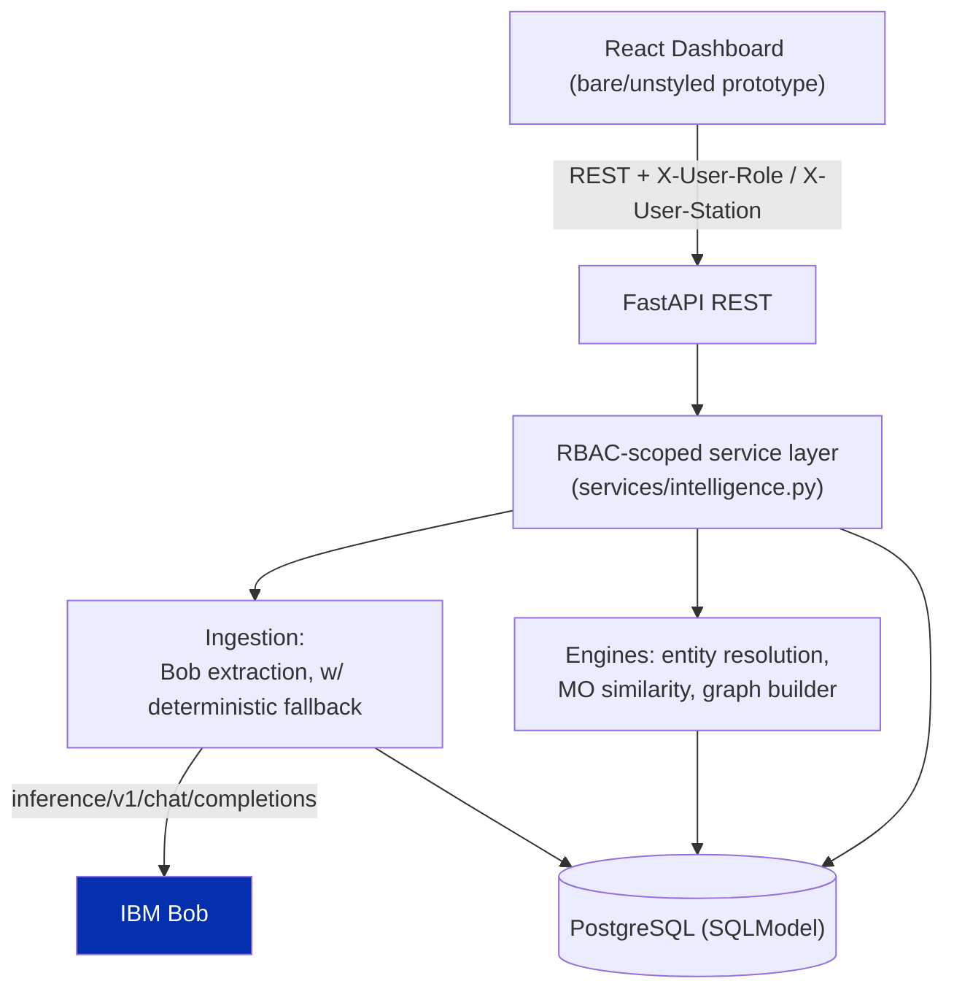

# Architecture

## System Architecture

Two entry points exist conceptually (the REST API for the dashboard, and Bob for
extraction), but both funnel through **one shared service layer**
(`app/services/intelligence.py`) that owns RBAC scoping and calls the same
engines - there is exactly one code path for "resolve entities," "compute MO
edges," and "build the graph," regardless of how a FIR was ingested.

## Components

| Component | Technology | Responsibility |
|---|---|---|
| Frontend | React 19 + TypeScript + Vite (Bun) | Bare, unstyled prototype dashboard: station stats, offender list, syndicate graph, RBAC role switcher |
| Backend API | FastAPI + SQLModel | REST endpoints, RBAC dependency, request/response schemas |
| Extraction | IBM Bob inference API + a deterministic regex/section parser fallback | Turns a raw digitized FIR document into structured fields |
| Entity Resolution | RapidFuzz + Double Metaphone + union-find | Links suspects across FIRs by exact identifiers, phonetic/fuzzy name match, and MO edges |
| MO Similarity | sentence-transformers (`all-MiniLM-L6-v2`) | Embeds FIR narratives; flags near-identical "scripts" reused across districts |
| Graph | NetworkX | Builds the Suspect/FIR/Station graph exported to the frontend's force-directed view |
| Database | PostgreSQL 16 (Docker) via SQLModel | Stores stations, FIRs, suspects, and resolved offender clusters |

## Data Flow

1. A raw digitized FIR (labeled-field CCTNS-style text) is POSTed to `/ingest`,
   optionally with a `station_id` hint.
2. `services.intelligence.extract_fir()` calls the Bob inference client first; on
   any failure (network, auth, malformed response) it logs a warning and falls
   back to `engine/parser.py`'s deterministic extraction - the caller never sees
   the difference beyond an `extraction_source` field on the stored FIR.
3. The extracted FIR and its suspects are persisted (`FIRRecord`, `SuspectEntity`).
4. `POST /detect` runs `services.intelligence.run_syndicate_detection()`:
   - `engine/mo_similarity.py` embeds every FIR's modus operandi and proposes
     inter-district edges between suspects whose FIRs read as the same script.
   - `engine/entity_resolution.py` unions suspects by exact identifiers, phonetic
     name match, and the MO edges above, using blocking + union-find to stay
     near-linear.
   - Results are written as `RepeatOffenderCluster` rows, each with a confidence
     score, human-readable `match_reasons`, and a `syndicate_flag`.
5. Every read (`/dashboard/summary`, `/offenders`, `/graph`, `/suspects/{id}`)
   depends on `core.rbac.get_scope`, which resolves the caller's `X-User-Role` /
   `X-User-Station` headers against the database into a `Scope` (an allow-list of
   visible station IDs, or `None` for state-wide) *before* any query runs.
6. The React dashboard's Role Switcher sets those headers on every subsequent
   request via `openapi-fetch` middleware - there is no login flow, this is the
   entire RBAC demonstration.

## Security Considerations

- `BOB_API_KEY` and the database URL live only in `src/.env`, which is
  git-ignored; `src/.env.example` documents every variable with a dummy value.
- RBAC is enforced in the service layer against the database, not in the
  frontend and not via a prompt - a Station Officer's requests are scoped by a
  server-side dependency that every route depends on, so there is no route where
  scoping can be accidentally skipped.
- No LLM ever sees cross-tenant data or makes an authorization decision - Bob's
  only input is the raw text of a single FIR being ingested, and its only output
  is the structured extraction of that same FIR.
- CORS is restricted to the frontend's own origin (`CORS_ORIGINS` in `.env`).

## Scalability Notes

- Entity resolution blocks candidate suspect pairs by Double Metaphone key and
  by exact-identifier inverted index before any fuzzy comparison runs, avoiding
  the O(n^2) pairwise blowup that would not survive CCTNS's real scale (3+ crore
  FIRs). The in-memory union-find is incremental; a production deployment would
  swap it and the NetworkX graph for a graph database (e.g. Neo4j) with the same
  blocking strategy, without changing the resolution algorithm itself.
- The FastAPI backend is stateless per request and could be horizontally scaled
  behind a load balancer; Bob extraction calls are the natural bottleneck for
  ingestion throughput and would benefit from batching.
